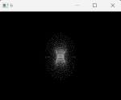

# Problem Definition

> 3D rendering is a common modern computing task, relevant in many different applications from animation to engineering. It consumes a significant number of clock cycles / computing time on generalized hardware, so it is often desirable to offload the task to a secondary, specialized microprocessor.

> Graphics cards are microcontrollers that are purpose built to handle parallelizable tasks, including graphics rendering. It contains its own microprocessor, the GPU, as well as its own memory and I/O.

> In this project, we'll build a simple 3D graphics engine on the DE10-Standard. It will show a torus on a monitor using the VGA port, and provide controls to rotate the torus. 

### Effect on the user
> 3D rendering lends itself easily to matrix calculations, which is a generalized task with many applications.
> Offloading graphics can allow the main processor to handle other tasks, increasing the efficiency of the device as a whole. 
> Hardware architectures that excel at parallel tasks are also conveniently applicable in other computational tasks like machine learning, scientific computing, cryptocurrency and more. 

> Real graphics cards provide parallel computing through CUDA and ROCm software tools.
> Specialized hardware is also more efficient than general purpose hardware, and can be optimized for lower resource settings. This allows the users to decrease and limit their power consumption and overall power requirements.

# Functional Description
> When the program starts, a connected monitor will show a rendered torus.
> The user has the option to interact with the system using buttons and switches.Buttons 0, 1, and 2 will correspond to rotations in the X, Y, and Z axis, and switches 0, 1, and 2 will control the direction of these rotations respectively.
> The 3D torus, in its rotated orientation is rendered to a 2D frame buffer that is then displayed on the connected monitor in real time. This operation is done using the VGA controller. 

> Overall the system maintains the state of a torus, and different inputs manipulate that state by rotating it. Then, the system outputs that state continuously to the display in the form of a projection to a 2D plane. The points on the 2D plane are sent to the frame buffer, which gets forwarded to the pixel buffer and is transformed into a display signal by the VGA DAC.

# Input/Output
> Currently, our output requirement is to rotate the object, control the direction of the object, and measure rotation speed.
> To accomplish this, we assigned our inputs to be buttons(actuator), switches(actuator), and a timer(sensor) for this device.
> Buttons are held to rotate the object, the switches control the direction, and the timer checks the button hold for an appropriate rotation speed.
> These inputs manipulate the internal torus state, which is converted to an ouput: a frame buffer. 

> Our inputs in our example use the buttons and switches on the board itself. However, a more in depth project would probably add a PCI-express port to directly take commands from the generalized processor. The motherboard should contain a PCIe controller, and the device we are making would contain a PCIe interface chip such as the Microchip PCI11400. 
> Drivers have to be made for both the CPU and the GPU, so that they communicate over some specified protocol and transfer required information. 
> A programming language could also be designed for programming GPU drivers in general, like OpenGL, CUDA or RoCM.
> In our case, we skip the intermediate communication protocol and transfer the information directly from the timer and buttons. When the button is held, the timer is used to measure the time passed since the last render to change the torus state at a consistent rate.

> Our ouput consists of a VGA controller, which is the ADV7123 on the DE10-Standard. Many other VGA DAC's exist, although this one in particular is easy to work with as it constantly just reads a pixel buffer, sacrificing versatility for ease of development. A more modern solution would use an HDMI or Display port controller, such as the Texas Instruments TDP158. However, an HDMI or DP transceiver would work quite differently than the ADV7123, as there are more compilicated communications protocols to be implemented than just a writable pixel buffer. Unlike VGA, which is a one sided, analog protocol, HDMI and DP are digital protocols that may contain 2-way communication.
> This could a bit of complexity to the software driver.

# Initial Software Design

### Initialization
> On initialization, we orient the frame to be rendered in the z direction, with at a further z distance pointing towards the origin.
> The torus is initialized in the X-Y plane, such that we could rotate a circle in the X-Z plane and rotate it around the Z axis to form the torus.
> To avoid having to clear the hardware frame buffer manually, we maintain a separate engine frame buffer.
> The engine frame buffer is directly written to by the renderer, which is cleared at the start of each cycle.
> At the end of the cycle, the engine frame buffer is copied to the hardware frame buffer.

### Inputs
> The buttons and switches are sampled once per render cycle, and the hardware timer is used to find the time passed since the last sample. This allows direct control of the rotation rate, so that it can be a constant value.

### Rendering
> Since our engine is only rendering one specific object, we can optimize it very specifically.
> We simply trace points on the surface on the torus, and project them onto the viewplane.
> A z-buffer is maintained, such that pixels that overwrite a previous pixel are only written if they are closer to the viewer than the previous point.
> The cycle will likely spend most of the time writing projecting points onto the frame and updating the z-buffer. 

### Donut Generation
> To trace the outside of our donut, we simply sweep theta and phi in 2 planes.
$$ (x,y,z) = (R_2 + R_1 \cos \theta, R_1 \sin \theta, -(R_2+R_1 \cos \theta)\sin \phi )$$
> $R_2$ represents the major radius of the donut, while $R_1$ is the internal radius of the torus.

> This generates a list of points on the surface on the donut, which we can then rotate by applying a quaternion rotation.
> To rotate a point using quaternions, we convert the $x,y,z$ values to a quaternion $p=0 + x\hat i + y\hat j + z \hat k$.

> The desired rotation axis $a,b,c$ and angle $\theta$ is expressed as a another quaternion $q=\cos(\theta / 2)( 0 + a\hat i + b\hat j + c\hat k)$.
> To rotate the point, we multiply these quaternions together in the form
$$p' = qpq^{-1}$$

> Once all the points are rotated, we then project them onto our camera plane. This is a simple perspective calculation, where $K_1$ is the distance from the camera to the projection plane, and $K_2$ is the distance from the camera to the center of the donut.

$$x' =\frac{x * K_1}{K_2 + z}$$
$$y' = \frac{y * K_1}{K_2 + z}$$

> We check the z buffer, which is initialized with all zeros. If the z position of the new pixel is closer to the screen than the previous, we overwrite the previous value. Otherwise, we ignore this point on the torus.
> To streamline this operation, we use the value of $z^{-1}$, since 0 would be a distance of infinity and any large value corresponds to a closer pixel (unless it's negative).

> Once the frame and z buffer are updated, we copy each pixel from the engine frame buffer to the hardware pixel frame buffer. On completion, the frame buffer is reset to all 0's (black).

# Prototyping Plan

> Prototyping the renderer can be done in software, which we will do in Python. We use numpy and cv2 for a simple display and math tools which are rebuilt later on in C.

> The DE10-SoC simulator at [https://cpulator.01xz.net/?sys=arm-de1soc](https://cpulator.01xz.net/?sys=arm-de1soc) contains the same VGA pixel buffer as on the DE10-Standard, and provides an easy way to experiment and test the software on simulated hardware.
> Once we had fleshed out the rendering engine in python, we would first test the engine on simulated hardware before finally testing it on actual hardware.

# Microcontroller
> A suitable microcontroller, is the Nvidia Tegra line of embedded graphics processors. Another option is the AMD Radeon E9260 embedded graphics cards. These solutions are definitely quite proprietary however, and would likely require a large order number for access. More fleshed out development boards like the Nvidia Jetson line provide all the hardware needed on a single board, rather than single IC's that would need to be hobbled together.

# Revised Software Design

> We came accross two major issues in the software. The first was that the University version of the Intel FPGA Monitor Program allowed limited manipulation of the compiler flags. To use math.h, the `-lm` flag must be appended as the *last* flag to the compiler. However, we could not do that as the Monitor Program added its own flags to the end. As a result, we had to write our own functions for sine and cosine. We built a relatively inaccurate approximation using a Taylor series, mostly because it is good enough for our needs. 

> We use the taylor series of the sine function down with 6 terms ($x^5$, although even powers of $x$ are multiplied by 0). This accurately covers $\sin(x)$ from $-\frac{\pi}{2} \to \frac{\pi}{2}$. To complete the domain of a full unit circle, we "wrap" around values from $\frac{\pi}{2} \to \pi$ and $-\pi \to -\frac{\pi}{2}$. This would not work for cosine, since the range of output values is $0\to 1$, not $-1 \to 1$ like it is for sine. To workaround this we forward the cosine function to just be $cos(x): x \to sin(x + \pi/2)$

> We also ran into issues with our implementation of quaternions, which were not able to be fixed in a reasonable amount of time. We simply avoided this by using euler matricies to compute the rotations instead, which have some flaws but was easier to implement.
> A 3D rotation in 3 axes $\alpha, \beta, \gamma$ on a point $p$ can be computed using the following matrix multiplication.

$$p' = p \begin{bmatrix}
   \cos\alpha & -\sin\alpha & 0 \\
   \sin\alpha & \cos\alpha & 0 \\
    0 & 0 & 0
\end{bmatrix}
\begin{bmatrix}
    \cos\beta & 0 & \sin\beta \\
    0 & 1 & 0 \\
    -\sin\beta & 0 & \cos\beta 
\end{bmatrix}
\begin{bmatrix}
    1 & 0 & 0 \\
    0 & \cos\gamma & -\sin\gamma \\
    0 & \sin\gamma & \cos\gamma
\end{bmatrix}
$$

> This computation is done in a simplified form, although it is much harder to read than this matrix form so we won't show it here.
> We also exclude the second, $y$-axis matrix as its effect is negligable while increasing the comput time. The $y$-axis rotation simply rotates the donut on its major axis, which shouldn't even be visible if the resolution was high enough. Thus, as an optimization step we just don't compute this rotation at all.
