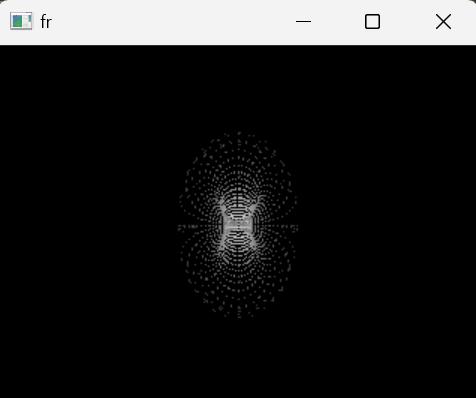
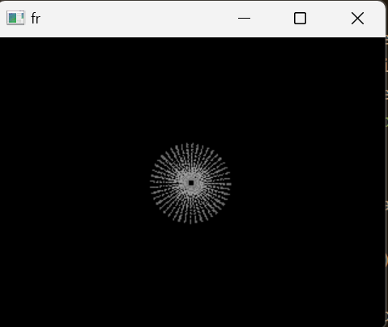

# Problem Definition

> 3D rendering is a common modern computing task, relevant in many different applications from animation to engineering. It consumes a significant number of clock cycles / computing time on generalized hardware, so it is often desirable to offload the task to a secondary, specialized microprocessor.

> Graphics cards are microcontrollers that are purpose built to handle parallelizable tasks, including graphics rendering. It contains its own microprocessor, the GPU, as well as its own memory and I/O.

> In this project, we'll build a simple 3D graphics engine on the DE10-SoC. It will show a 3D torus on a monitor using the VGA port, and provide controls to rotate the torus. 

### Effect on the user
> 3D rendering lends itself easily to matrix calculations, which is a generalized task with many applications.
Offloading graphics can allow the main processor to handle other tasks, increasing the efficiency of the device as a whole. 
> Hardware architectures that excel at parallel tasks are also conveniently applicable in other computational tasks like machine learning, scientific computing, data mining and more. 

> Real graphics cards provide this through CUDA and ROCm software tools.
> Specialized hardware is also more efficient than general purpose hardware, and can be optimized for lower resource settings. This allows the users to decrease and limit their power consumption and overall power requirements.

# Functional Description
> ("Adding pictures would be very effective")
> When the program starts, a connected monitor will show a rendered torus.
> The user has the option to interact with the system using buttons and switches.Buttons 0, 1, and 2 will correspond to rotations in the X, Y, and Z axis, and switches 0, 1, and 2 will control the direction of these rotations respectively.
> The 3D torus, in its rotated orientation is rendered to a 2D frame buffer that is then displayed on the connected monitor in real time. This operation is done using the VGA controller. 

# Input/Output
> Currently, our output requirement is to rotate the object, control the direction of the object, and measure rotation speed.
> To accomplish this, we assigned our inputs to be buttons(actuator), switches(actuator), and a timer(sensor) for this device.
> Buttons are held to rotate the object, the switches control the direction, and the timer checks the button hold for an appropriate rotation speed.
> These inputs manipulate the internal torus state, which is converted to an ouput: a frame buffer. 
> This frame buffer is written to the hardware VGA controller, which displays the updated frame buffer to the VGA port
> VGA is a digital standard, and so are the two most common display protocols in modern displays (DisplayPort and HDMI)
> Since it is on the DE10-SOC, our output IC will be a 24-bit VGA DAC.

# Initial Software Design

### Initialization
> On initialization, we orient the frame to be rendered in the z direction, with at a further z distance pointing towards the origin.
> The torus is initialized in the X-Y plane, such that we could rotate a circle in the X-Z plane and rotate it around the Z axis to form the torus.
> To avoid having to clear the hardware frame buffer manually, we maintain a separate engine frame buffer.
> The engine frame buffer is directly written to by the renderer, which is cleared at the start of each cycle.
> At the end of the cycle, the engine frame buffer is copied to the hardware frame buffer.

### Inputs
> The buttons and switches are sampled once per render cycle, and the hardware timer is used to find the time passed since the last sample. This allows direct control of the rotation rate, so that it can be a constant value. 

### Rendering
> Since there is only one rendered object, it will be pretty optimized. We simply trace points on the surface on the torus, and project them onto the viewplane.
> A z-buffer is maintained, such that pixels that overwrite a previous pixel are only written if they are closer to the viewer than the previous point.
> The render cycle loops indefinitely, as quickly as it can to output the best framerate possible.
> The cycle will likely spend most of the time writing projecting points onto the frame and calculating the z-buffer. 

# Prototyping Plan

For prototyping on our machines, we write the engine in a similar manner in Python and run that locally with `python honey-cruller`. This allows us to validate our work before implementing them on the DE10-SoC hardware. To run `honey-cruller`, install `numpy` and `cv2` packages and then run with the `python honey-cruller.py` command. 

This will bring up a frame that looks like this:

To rotate / simulate the buttons, the `WASD` keys are used. Here is how the donut looks like rotated:

To stop the program we use `ctrl c`. 