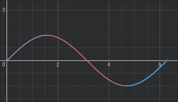

# Problem Definition

> 3D rendering is a common modern computing task, relevant in many different applications from animation to engineering. It consumes a significant number of clock cycles / computing time on generalized hardware, so it is often desirable to offload the task to a secondary, specialized microprocessor.
> Graphics cards are microcontrollers that are purpose built to handle parallelizable tasks, including graphics rendering. It contains its own microprocessor, the GPU, as well as its own memory and I/O.
> The DE10-Standard doesn't any specialized parallelization hardware, but we can still run the software on it, albeit slowly. 

> In this project, we'll build a simple 3D graphics engine on the DE10-Standard. It will show a torus on a monitor using the VGA port, and provide controls to rotate the torus. 

### Effect on the user
> 3D rendering lends itself easily to matrix calculations, which very common task in many applications.
> Offloading parallelized tasks can free up CPU cycles, increasing the efficiency of the device as a whole. 
> Hardware architectures that excel at parallel tasks are also conveniently applicable in other computational tasks like machine learning, scientific computing, cryptocurrency and more. 

> Real graphics cards provide parallel computing through software tools like CUDA and ROCm.
> Specialized hardware is also more efficient than general purpose hardware at these tasks, and can be optimized for lower resource settings. This allows the users to decrease and limit their power consumption and overall power requirements.

> Overall, generalized hardware is more useful. However, it is limited in certain applications and having a specialized card in personal computers allows for cheaper computers to be better at a wider range of tasks. 

> Environmentally, specialized hardware optimizes small efficiencies that generalized hardware would waste. Many, if not most forms of scientific computing uses parallelized hardware, thus improving the field and human technology overall. This allows human society to develop new and better methods of taking care of the environment.

# Functional Description
> When the program starts, a connected monitor will show a rendered torus.
> The user has the option to interact with the system using buttons and switches. Buttons 0 and 1 will correspond to rotations in the X and Z axis, and switches 0 and 1 will control the direction of these rotations respectively. We only need rotations in two of the 3, as the Y axis rotation just rotates the donut in the plane it is widest in.
> Functionally, a Y axis rotation should not be noticiable so we exclude it to optimize the rendering process.
> The 3D torus, in its rotated orientation is projected to a 2D plane, and the x-y coordinates are written to a frame buffer. That frame buffer is then displayed on the connected monitor in real time. 

> Overall the system maintains the state of a torus, and different inputs manipulate that state by rotating it. Then, the system outputs that state continuously to the display in the form of a projection to a 2D plane. The points on the 2D plane are sent to the frame buffer, which gets forwarded to the pixel buffer and is transformed into a display signal by the VGA DAC.

# Input/Output
> Currently, our output requirement is to rotate the object, control the direction of the object, and measure rotation speed.
> To accomplish this, we assigned our inputs to be buttons(actuator), switches(actuator), and a timer(sensor) for this device.
> Buttons are held to rotate the object, the switches control the direction, and the timer checks the time passed while the button is pressed to control the rotation speed.
> These inputs manipulate the internal torus state, which is converted to an ouput: a frame buffer. 

> Our inputs include the buttons and switches on the board itself. However, a more in depth project would probably add a PCI-express port to directly take commands from the generalized processor. The motherboard should contain a PCIe controller, and the device we are making would contain a PCIe interface chip such as the Microchip PCI11400. 
> Drivers have to be made for both the CPU and the GPU, so that they communicate over some specified protocol and transfer required information. 
> A programming language could also be designed for programming GPU drivers in general, like OpenGL, CUDA or RoCM.
> In our case, we skip the intermediate communication protocol and transfer the information directly from the timer and buttons. When the button is held, the timer is used to measure the time passed since the last render to change the torus state at a consistent rate.

> Our ouput consists of a VGA controller, which is the ADV7123 on the DE10-Standard. Many other VGA DAC's exist, although this one in particular is easy to work with as it constantly just reads a pixel buffer, sacrificing versatility for ease of development. VGA controllers are DAC's, and there are many other controllers with more capabilities that are not as easy to use. A more modern solution would use an HDMI or Display port controller, such as the Texas Instruments TDP158. However, an HDMI or DP transceiver would work quite differently than the ADV7123, as there are more compilicated communications protocols to be implemented than just a writable pixel buffer. Unlike VGA, which is a one sided, analog protocol, HDMI and DP are digital protocols that may contain 2-way communication.

# Initial Software Design

### Initialization
> On initialization, we position the camera on the positive z axis, and point it towards the origin with the rendering plane to be somewhere in between. A distance is experimentally found that keeps the torus large but in frame.
> The torus is initialized in the X-Z plane, such that we could rotate a circle in the X-Y plane and rotate it around the Z axis to form the torus.
> To avoid having to clear the hardware frame buffer manually, we maintain a separate engine frame buffer.
> The engine frame buffer is directly written to by the renderer, which is cleared at the start of each cycle.
> At the end of the cycle, the engine frame buffer is copied to the hardware frame buffer.
> This significantly increases the frame rate, as it is easier to "erase" a pixel on the next frame using a memory buffer than it is on the hardware pixel buffer for the ADV7123 chip.

### Inputs
> The buttons and switches are sampled once per render cycle, and the hardware timer is used to find the time passed since the last sample. This allows direct control of the rotation rate, so that it can be a constant value.

### Frame Buffering
> Since our engine is only rendering one specific object, we can optimize it very specifically.
> We simply trace points on the surface on the torus, and project them onto the viewplane.
> A z-buffer is maintained, such that pixels that overwrite a previous pixel are only written if they are closer to the viewer than the previous point.
> The cycle will likely spend most of the time writing projecting points onto the frame and updating the z-buffer. 

### Donut Generation
> To render the donut, we simply trace points on its surface and project them onto a plane. 

> The surface of a torus can be thought of as circle in a plane, rotated around some axis that
> belongs in the same plane. Thus, we could express points on its surface using the following
> expression and sweeping the angles $\theta$ and $\phi$.
\begin{figure}[h]
$$ (x,y,z) = (R_2 + R_1 \cos \theta,\quad R_1 \sin \theta, \quad -(R_2+R_1 \cos \theta)\sin \phi )$$
\caption{Tracing the Surface of a Torus}
\end{figure}
> $R_1$ is the radius of the small circle in the $x-y$ plane used to generate the torus, while 
> $R2$ is the radius it is positioned and rotated around the $y$ axis)

> This generates a list of points on the surface on the donut, which we can then rotate by applying a quaternion rotation.
> To rotate a point using quaternions, we convert the $x,y,z$ values to a quaternion $p=0 + x\hat i + y\hat j + z \hat k$.

> The desired rotation axis $a,b,c$ and angle $\theta$ is expressed as a another quaternion $q=\cos(\theta / 2)( 0 + a\hat i + b\hat j + c\hat k)$.
> To rotate the point, we multiply these quaternions together in the form
\begin{figure}[h]
$$p' = qpq^{-1}$$
\caption{Rotations Using Quaternions}
\end{figure}

> Once all the points are rotated, we then project them onto our camera plane. This is a simple perspective calculation, 
> where $K_1$ is the distance from the camera to the projection plane, and $K_2$ is the distance from the camera to the center of the donut.
> We could project without a perspective calculation by using the $x-y$ points directly, but perspective adds to the immersiveness of the visualization immensely.

\begin{figure}[h]
$$x' =\frac{x * K_1}{K_2 + z}$$
$$y' = \frac{y * K_1}{K_2 + z}$$
\caption{Projections with Perspective}
\end{figure}

> We check the z buffer, which is initialized with all zeros. If the z position of the new pixel is closer to the screen than the previous, we overwrite the previous value. Otherwise, we ignore this point on the torus.
> To streamline this operation, we use the value of $z^{-1}$, since 0 would be a distance of infinity and any large value corresponds to a closer pixel (unless it's negative).

> Once the frame and z buffer are updated, we copy each pixel from the engine frame buffer to the hardware pixel frame buffer. On completion, the frame buffer is reset to all 0's (black).

# Prototyping Plan

> Prototyping the renderer can be done in software, which we will do in Python. We use numpy and cv2 for a simple display and math tools which are rebuilt later on in C.

> The DE10-SoC simulator at [https://cpulator.01xz.net/?sys=arm-de1soc](https://cpulator.01xz.net/?sys=arm-de1soc) contains the same VGA pixel buffer as on the DE10-Standard, and provides an easy way to experiment and test the software on simulated hardware.
> Once we had fleshed out the rendering engine in python, we would first test the engine on simulated hardware, then finally test it on actual hardware.

> Our prototype will implement a very optimized render of a torus, that is rotated using the buttons. This allows us to maintain a comfortable frame rate on a single thread program.

> A proper rendering algorithm like ray tracing or rasterization would very likely run way 
> too slow on the DE10 without a lot of work into its optimization. 
> To avoid dealing with this, we used an overly specific way to render the 
> donut that isn't very useful for anything else, but is much faster and easier to compute.
> In terms of softare, we will attempt to implement everything discussed in the previous section
> However, our initial design is already a minimized prototype that should be feasible, and not a full project that we would build given more time.

# Microcontroller
> Scalar processing, like the name suggests, operates on one scalar value at a time. 
> On the other hand, a vector processor would be able to apply an operation on multiple values in one clock cycle. 
> Graphics processing is most efficiently and optimally suitable for vector processors, 
> of which include integrated and discrete forms. Integrated graphics processors share
> system memory and I/O with the CPU, while discrete processors have their own. 

> Two microcontrollers representing each kind include the Nvidia Jetson, which contains a Nvidia Tegra GPU, and the Microchip PIC32MZ DA family of microcontrollers. 
> The latter is significantly less powerful, and more suited to 2D rendering while the first is more capable of general floating point matrix calculations and 3D rendering.
> Our highly optimized 3D renderer that only draws a specific donut could probably be run on the latter with good performance, but a more generalized and versatile engine would likely require a more powerful graphics processor. 
> One key difference is that the Jetson contains a discrete graphics processor, while the PIC32MZ DA contains an integrated graphics processor.

> The Nvidia Jetson comes with an quad core ARM A57 processor and 128-core Nvidia Maxwell graphics processor. 
> In comparison, the PIC32MZ DA comes with a MIPS microActiv processor, which
> is marketed as the loweest power CPU family available in the world.
> It uses the MIPS instruction set, which is much more niche and less powerful than ARM but 
> could be suitable in lower power, low requirement uses.
> The Jetson on the other hand requires significantly more power, but also provides much more computational capability.

> The Nvidia Jetson can be programmed using any of the widely available ARM and 
> Nvidia development tools. 
> The PIC32MZ DA has fewer tools like MPU Harmony development kit, but is still well supported by
> its manufacturer.

> Both microcontrollers have development kits with onboard I/O and interfaces that could be used to make development easier. 
> These development kits come with GPIO pins that could allow us to attach buttons and switches easily, as well as display controller IC's that allow usage of those display ports.

> Since our goal is 3D rendering, the Jetson likely has much more of the required compute power for the tasks we want to complete.
> The PIC32MZ chip would probably require much more optimization, or 
> run at a way lower framerate.

# Revised Software Design

> Given more time, one preferrable feature would be to add brightness to the pixels based on depth and direction.
> The 3D nature of the donut is only visible because there is not enough computational power, so the wireframe gives away its depth.
> If the device was powerful enough to render the whole donut, it would just look like a deforming blob.

> Another change would be to parallelize the computations. We are only using a single thread, but
> our program would massively benefit from using multiprocessing. Even the Cortex-A9 on
> the DE10-Standard has two cores, which we could've used to improve the render rate. 
> On a more suitable microprocessor, we would convert the calculations into sets of matrix 
> calculations that can be run on a vector processor like the Nvidia Tegra.

> Since the calculations are done frame by frame, polling would likely still be the better 
> form of input in our prototype. Interrupts don't really serve a purpose here unless we add in
> more objects and complexity. One possible use case could be a change in rendering settings, such as lighting, detail, aliasing, etc.

> Our software is also very prematurely optimized, because the DE10-Standard is not very fast 
> at rendering calculations. These optimizations make the render look detailed and the 
> experience enjoyable, but there is a lack of extensibility in the program. 
> A larger project could utilize more generalized techniques, such as rasterization while also
> utilizing more relevant hardware.

> A more generalized input space would also be desireable. Instead 
> of only allowing rotations of a donut as input, a more useful input could be 
> something like an implementation of the OpenGL API, so that the user could 
> render anything they wanted to program. 

# Results From Prototyping

> We were able to get an early version working, but some small changes had to be made.
> Although the code worked in the simulator, there was an extra compile flag that 
> could not be added to the free version of the Intel FPGA Monitor Program. 
> To solve this issue, we created our own sine and cosine functions.
> Rotations were also changed to be calculated using rotation angles instead of quaternions, 
> due to some problems we weren't able to fix in time.

> The University version of the Intel FPGA Monitor Program allowed limited manipulation of the compiler flags. To use math.h, the `-lm` flag must be appended as the *last* flag to the compiler, which is done by default in the simulator. 
> However, we could not replicate it on the DE10-Standard as the Monitor Program added its own flags to the end of the command.
> As a result, we had to write our own functions for sine and cosine. We built a relatively inaccurate approximation using a Taylor series, albeit good enough for our needs. 

> We used the taylor series of the sine function up to $x^5$. This accurately 
> covers $\sin(x)$ from $-\frac{\pi}{2} \to \frac{\pi}{2}$
> \footnote{Although the domain reaches down to $-\frac{\pi}{2}$, we 
> cut it off at $0$ because $0\to 2\pi$ is a much easier function domain to use
> than $-\frac{\pi}{2}\to\frac{3\pi}{2}$}.
> To complete the domain of a full unit circle, we "wrap" around values from $\frac{\pi}{2} \to \pi$ and $-\pi \to -\frac{\pi}{2}$. 
> This would not work for cosine, since the range of output values is $0\to 1$, not $-1 \to 1$ like it is for sine. To workaround this we forward the cosine function to just be the sine function with a quarter rotation offset.

\begin{figure}[h]
$$taylorsin(x): x \to x - \frac{x^3}{3!} + \frac{x^5}{5!} $$
$$ \sin(x):  \begin{cases} 
    x \to taylorsin(x)\quad \big ( 0 \leq x \leq \frac{\pi}{2} \big )\\
    x \to taylorsin(\pi - x)\quad \big ( \frac{\pi}{2} \leq x \leq \frac{3\pi}{2} \big )\\
    x \to taylorsin(x - 2\pi)\quad \big ( \frac{3\pi}{2} \leq x \leq 2\pi \big )\\
   \end{cases}
$$
$$cos(x): x \to sin(x + \pi/2)$$
\caption{Approximated Functions of Sine and Cosine}
\end{figure}

> We also ran into issues with our implementation of quaternions, which were not able to be fixed in a reasonable amount of time. We simply avoided this by using euler matricies to compute the rotations instead, which have some flaws but was easier to implement.
> A 3D rotation in 3 axes $\alpha, \beta, \gamma$ on a point $p$ can be computed using the following matrix multiplication.

\begin{figure}[h]
$$p' = p \begin{bmatrix}
   \cos\alpha & -\sin\alpha & 0 \\
   \sin\alpha & \cos\alpha & 0 \\
    0 & 0 & 0
\end{bmatrix}
\begin{bmatrix}
    \cos\beta & 0 & \sin\beta \\
    0 & 1 & 0 \\
    -\sin\beta & 0 & \cos\beta 
\end{bmatrix}
\begin{bmatrix}
    1 & 0 & 0 \\
    0 & \cos\gamma & -\sin\gamma \\
    0 & \sin\gamma & \cos\gamma
\end{bmatrix}
$$
\caption{Matrix Rotations of a Point P in 3 Dimensions}
\end{figure}

> This computation is optimized into a simplified form, although it isn't really readable or clear what is going on so we won't show the equation here. 
> We also exclude the second, $y$-axis matrix as its effect is negligable while increasing the compute time. The $y$-axis rotation simply rotates the donut in the flat plane, which shouldn't even be visible if the resolution was high enough. Thus, as an optimization step we just don't compute this rotation at all.

# Source Code
- All source code and version history is available at
[https://github.com/usymmij/boston-cream](https://github.com/usymmij/boston-cream)
- The files are also attached separately to the submission.

### Work Division
- Khalid was responsible for the output handling, providing an interface to simplify writing to the output. This included creating the engine buffer, and copying it to the hardware pixel buffer.
- Shiv was responsible for the input handling, converting the button presses into rotation vectors.
- James was responsible for the rendering of the donut, and its rotation based off of the input vector.

